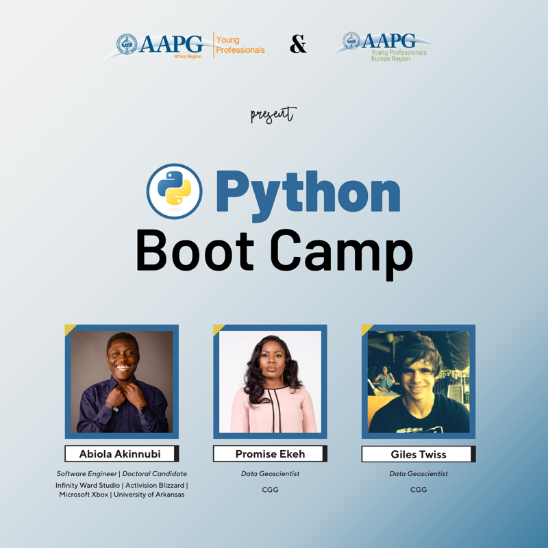

# **AAPG PYTHON BOOTCAMP**

This repo contains course materials for AAPG PYTHON BOOTCAMP 2024.

## **Facilitators:**
1. Giles Twiss
2. Promise Ekeh
3. Abiola Akinnubi

## Week 1: Python Basics by Abiola Akinnubi
- Data types
- Data structures
- Syntax

## Week 2: Python Packages for Data Analysis and Data Visualization - by Promise Ekeh
- Pandas
- Numpy
- Geopandas
- Matplotlib
- Plotly

## Week 3: Apply basic Python to Oil and Gas data by Giles Twiss
- Utilising packages for real world data

## Week 4: Basic machine learning by Giles Twiss
- Supervised and Unsupervised learning using real world case studies

## Week 5: Capstone Project 1 by Promise & Giles
## Week 6: Capstone Project 2 TBC 

